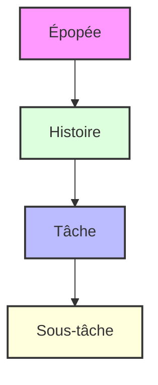

# Documentation du Flux de Travail Agile pour Cursor

Ce document fournit une documentation complète pour le système de flux de travail Agile intégré aux capacités d'IA de Cursor. Le flux de travail est conçu pour maintenir la concentration et la mémoire du projet et assurer un progrès constant grâce à une approche structurée du développement.

## Aperçu

Le flux de travail Agile-Cursor combine les méthodologies Agile traditionnelles avec le développement assisté par IA pour créer un processus de développement puissant et efficace. Il peut être utilisé de deux manières principales :

1. **Implémentation basée sur des règles** (Automatique)

   - Utilise `.cursor/rules/workflows/workflow-agile-manual` et `.cursor/templates`
   - Applique automatiquement les normes aux fichiers correspondants
   - Fournit une application cohérente de la structure

## Hiérarchie des Éléments de Travail



1. **Épopées**

   - Fonctionnalités importantes et autonomes
   - Une seule active à la fois
   - Exemple : "Système de matchmaking en ligne"

2. **Histoires**

   - Unités de travail plus petites et implémentables
   - Doivent appartenir à une Épopée
   - Exemple : "Création de profil utilisateur"

3. **Tâches**

   - Étapes d'implémentation technique
   - Critères d'achèvement clairs
   - Exemple : "Implémentation du schéma de base de données"

4. **Sous-tâches**
   - Éléments de travail granulaires
   - Inclut souvent des exigences de test
   - Exemple : "Écriture des tests unitaires"

## Structure de Plan de Projet et de Mémoire IA que le Flux de Travail produira

```
.ai/
├── prd.md                 # Document des Exigences du Produit
├── arch.md               # Enregistrement des Décisions d'Architecture
├── epic-1/              # Répertoire de l'Épopée actuelle
│   ├── story-1.story.md  # Fichiers d'histoire pour l'Épopée 1
│   ├── story-2.story.md
│   └── story-3.story.md
├── epic-2/              # Répertoire d'Épopée future
│   └── ...
└── epic-3/              # Répertoire d'Épopée future
    └── ...
```

## Phases du Flux de Travail

### 1. Planification Initiale

- Accent sur la documentation et la planification
- Modification uniquement de `.ai/`, docs, readme et règles
- Approbations requises pour le PRD puis l'Architecture

### 2. Phase de Développement

- Génère la première ou la prochaine histoire et attend l'approbation
- Implémentation de l'histoire approuvée en cours
- Exécution de l'histoire tâche par tâche
- Tests et validation continus

```mermaid
graph LR
    subgraph Phase PLAN
        A[Idée de Projet] --> B[Création du PRD]
        B --> C[Conception de l'Architecture]
        C --> D[Planification de l'Épopée]
        D --> E[Définition de l'Histoire]
    end

    subgraph Phase ACT
        E --> F[Implémentation de l'Histoire]
        F --> G[Tests & Validation]
        G --> H[Achèvement de l'Histoire]
    end

    subgraph Itération
        H --> |Histoire Suivante|E
        H --> |Épopée Terminée|I[Achèvement de l'Épopée]
        I --> |Épopée Suivante|D
        I --> |Projet Terminé|J[Publication]
    end

    style A fill:#f9f,stroke:#333,stroke-width:2px
    style B fill:#dfd,stroke:#333,stroke-width:2px
    style C fill:#dfd,stroke:#333,stroke-width:2px
    style D fill:#f9f,stroke:#333,stroke-width:2px
    style E fill:#bbf,stroke:#333,stroke-width:2px
    style F fill:#bbf,stroke:#333,stroke-width:2px
    style G fill:#bbf,stroke:#333,stroke-width:2px
    style H fill:#bbf,stroke:#333,stroke-width:2px
    style I fill:#f9f,stroke:#333,stroke-width:2px
    style J fill:#f9f,stroke:#333,stroke-width:2px
```



## Directives d'Implémentation

### Processus d'Implémentation d'Histoire

1. **Initialisation**

   - Vérifier que le répertoire `.ai` existe
   - Localiser l'architecture approuvée et l'histoire actuelle
   - S'assurer que l'histoire est correctement marquée comme en cours

2. **Flux de Développement**

   - Suivre le Développement Piloté par les Tests (TDD)
   - Mettre à jour régulièrement le statut des tâches/sous-tâches
   - Documenter toutes les notes d'implémentation
   - Enregistrer les commandes importantes utilisées

3. **Exigences d'Achèvement**
   - Tous les tests doivent passer
   - La documentation doit être mise à jour
   - L'utilisateur doit approuver l'achèvement

### Règles Critiques

> 🚨 **Règles Critiques :**
>
> - Ne jamais créer la première histoire sans l'approbation du PRD et de l'Architecture
> - Une seule Épopée peut être en cours à la fois
> - Une seule Histoire peut être en cours à la fois
> - Les Histoires doivent être implémentées dans l'ordre spécifié par le PRD
> - Ne jamais implémenter sans l'approbation de l'histoire par l'utilisateur (marquée comme en cours dans le fichier de l'histoire)

## Utilisation du Flux de Travail

La meilleure façon après la version 0.47.x+ de cursor est d'utiliser l'approche basée sur les règles, avec des règles manuelles, de sélection d'agent ou toujours activées. Je préfère les règles de type sélection manuelle pour les flux de travail, afin qu'elles ne soient pas dans un contexte si je n'en ai pas besoin (explication à suivre).

Si je commence un tout nouveau projet (avec ou sans un modèle de code existant), j'ai quelques options :

- Utiliser un outil externe pour générer le PRD (comme ChatGPT Canvas, o3 mini Web UI ou Google AI Studio)
- Utiliser le flux de travail et l'agent dans cursor pour générer le PRD
  (Cela dépend des préférences personnelles et de la prise en compte de la consommation de tokens dans cursor)

Si je fais cela dans cursor, je commencerai une nouvelle conversation Agent avec Claude 3.7 Thinking (ou choisirai un modèle différent si je m'inquiète de la consommation de crédits) et taperai quelque chose comme :

`Suivons le @workflow-agile-manual pour créer un PRD pour un nouveau projet que je veux créer qui fera XYZ, avec les fonctionnalités suivantes, etc. Concentrons-nous d'abord sur la fonctionnalité MVP qui sera de livrer X de manière minimale, mais prévoyons également quelques épopées pour des améliorations rapides ou futures telles que A, B et C.`

Comme cela peut être assez long, je vais souvent rédiger cette demande dans le dossier xnotes, puis la coller dans le chat, en veillant à ce que le @workflow soit toujours correctement ajouté.

Remarque : vous pouvez également modifier le workflow-agile-manual pour qu'il soit auto-sélectionnable par l'agent, cela fonctionne aussi de manière fiable - vous devrez simplement vous assurer que la description que vous lui donnez dans le frontmatter garantira son utilisation quand nécessaire (phases d'implémentation de PRD, d'histoire et de travail) - ou potentiellement en faire une règle "always". En commençant, c'est bien d'en faire une règle always, jusqu'à ce que votre projet atteigne une taille très significative, puis je suggère de la désactiver manuellement, car à ce stade, vous pourriez simplement faire des mises à jour très ciblées sur des fichiers ou des fonctionnalités spécifiques - et ne pas avoir besoin de tout le flux de travail en surcharge - ou vous pourriez vouloir sélectionner un flux de travail différent (peut-être un flux de travail de refactorisation, un flux de travail de test, un agent MCP externe, etc...)

L'agent devrait générer un brouillon de fichier prd.md dans un dossier .ai.

Je suggère à ce stade de ne pas approuver et de vous lancer directement - soit dans cursor avec l'agent, soit avec un outil externe - engagez-vous davantage avec l'agent pour affiner le document, demandez à l'agent de vous poser des questions sur les lacunes du document auxquelles il pourrait vouloir des réponses, demandez à l'agent s'il a besoin de clarifications qui permettraient à un agent développeur junior de comprendre et d'implémenter les histoires, demandez à l'agent si l'enchaînement des histoires a du sens, etc.

Une fois que vous estimez qu'il est dans un bon état, vous pouvez marquer le fichier comme status: approved.

À ce stade, je commencerais une autre conversation avec le flux de travail - l'agent vérifiera d'abord le prd, et ensuite, s'il est approuvé, proposera de créer (si ce n'est pas déjà existant et approuvé) le fichier d'architecture - et similairement, une nouvelle fenêtre de chat avec le flux de travail recherchera la première histoire ou l'histoire en cours.

Une fois qu'une histoire est en cours et approuvée par l'utilisateur, on peut demander à l'agent d'exécuter l'histoire. Une fois qu'une histoire ou une partie d'une histoire est terminée et que le fichier d'histoire est mis à jour avec les progrès par l'agent, je fais des commits fréquents (j'utilise ma règle manuelle macro gitpush.mdc). Après cela, je pourrais démarrer une nouvelle fenêtre de chat avec un contexte frais et le flux de travail rechargé. Une fois qu'une histoire est terminée (status: complete), testée et poussée, je commence toujours une nouvelle fenêtre de chat avec le flux de travail, et je demande à l'agent de "Créer le brouillon de la prochaine histoire" - ou je lui demande simplement ce qu'il pense devoir faire ensuite, il devrait reconnaître quelle est la prochaine histoire à faire à partir du prd et quelle histoire a été marquée comme terminée en dernier, et générer un brouillon pour la prochaine histoire, puis s'arrêter et demander mon approbation avant de poursuivre le codage.

Un exemple plus détaillé, un dépôt à jour et une vidéo arriveront bientôt, mais cela devrait donner les idées principales...

REMARQUE : Certains modèles (Sonnet 3.7 thinking) sont devenus un peu trop agressifs, donc les règles pourraient devoir être ajustées pour garantir davantage que l'agent ne commence pas à mettre à jour le code tant que l'histoire n'est pas approuvée.

## Meilleures Pratiques

1. **Documentation et conseils**

   - L'IA maintiendra les documents PRD et Architecture à jour - parfois, vous devrez lui dire de mettre à jour les fichiers prd et arch si nécessaire.
   - Documentez toutes les décisions importantes
   - Maintenez des notes d'implémentation claires
   - Faites créer par l'IA des fichiers readme.md dans chaque sous-dossier src pour l'aider à s'orienter

2. **Tests**

   - Faites écrire les tests par l'IA avant l'implémentation - un exercice amusant de TDD
   - Maintenez une couverture de test élevée
   - Vérifiez que tous les tests passent avant l'achèvement

3. **Suivi des Progrès**

   - Faites mettre à jour régulièrement le statut de l'histoire par l'IA (ou vous-même)
   - Enregistrez toutes les notes d'implémentation
   - Documentez l'historique des commandes

4. **Gestion du Contexte**
   - Démarrez une nouvelle instance du compositeur par histoire ou après des progrès significatifs enregistrés (enregistrés dans les mises à jour d'achèvement des tâches)
   - Utilisez le niveau de contexte approprié
   - Minimisez la surcharge de contexte
   - Envisagez de créer un flux de travail plus léger lorsque vous êtes en mode d'exécution d'histoire - qui n'a pas besoin de tous les modèles et de la surcharge de comment créer un prd et une architecture. Mais vous devrez considérer quels autres fichiers ou parties d'autres fichiers il pourrait avoir besoin de référencer pour conserver l'intrigue. C'est pourquoi j'utilise actuellement encore le flux de travail complet.

## Progression des Statuts

Les histoires suivent une progression de statut stricte :

```
Brouillon -> En Cours -> Terminé
```

Les épopées suivent une progression similaire :

```
Future -> Actuelle -> Terminée
```

## Intégration avec l'IA de Cursor

Le flux de travail est conçu pour fonctionner harmonieusement avec les capacités d'IA de Cursor :

1. **Planification Assistée par IA**

   - L'IA aide à créer et affiner le PRD
   - L'IA suggère des améliorations d'architecture
   - L'IA aide à la décomposition des histoires

2. **Implémentation Assistée par IA**

   - L'IA implémente les tâches d'histoire
   - L'IA maintient la couverture de test
   - L'IA met à jour la documentation

3. **Revue Assistée par IA**
   - L'IA vérifie les critères d'achèvement
   - L'IA suggère des améliorations
   - L'IA maintient la cohérence

## Économies de Coûts

- Les LLM en dehors de Cursor, si vous y avez accès, comme ChatGPT, Claude, Gemini, etc. sont également excellents pour générer le PRD initial et l'architecture, et vraiment itérer dessus.
- Dans Cursor, actuellement vous pouvez utiliser DeepSeek R1 par exemple qui semble être gratuit et également décent pour mettre à jour le PRD et l'architecture - mais j'ai trouvé qu'il est un peu moins fiable que d'utiliser Claude pour suivre le format que je veux - mais beaucoup moins cher, si vous essayez de faire toute la planification dans cursor.
