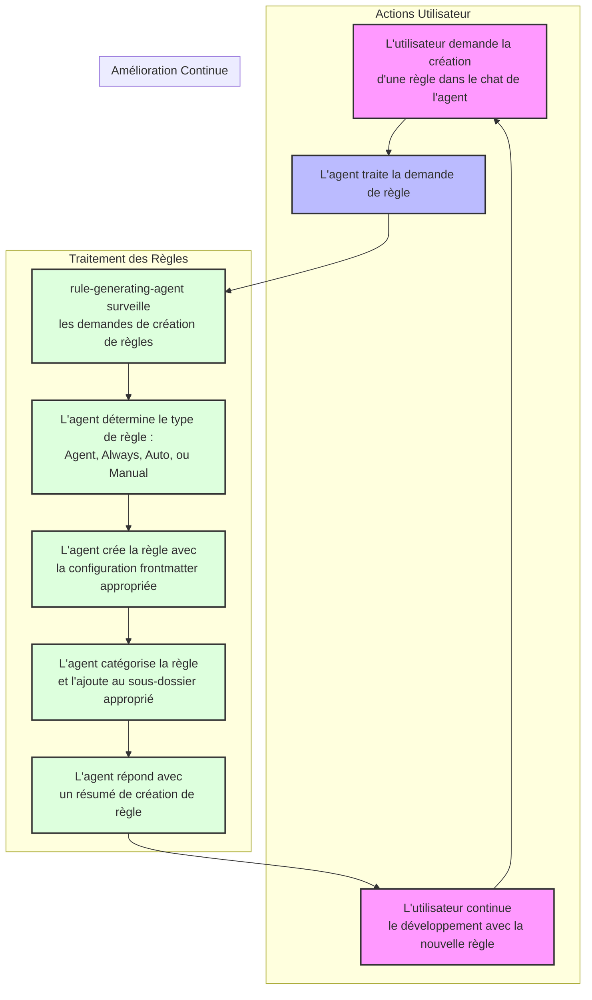

# Générateur de Règles et d'Agents Personnalisés Cursor selon les Bonnes Pratiques de BMad

19 avril 2025

Les mises à jour de Cursor avec la version 0.49 ont enfin apporté d'importantes améliorations aux règles ! Des correctifs de bugs très attendus.

Une nouvelle [vidéo](https://youtu.be/1wQUio9TiIQ?si=3KT5NiO5mDL8GR5P) et un nouveau [dépôt](https://github.com/bmadcode/BMAD-METHOD) sont disponibles, montrant comment utiliser les agents personnalisés en conjonction avec les règles. Cette approche est plus indépendante de Cursor si vous souhaitez essayer d'utiliser d'autres outils en combinaison avec Cursor.

16 avril 2025

Vous pouvez désormais générer des règles directement dans une conversation en utilisant la commande `/Generate Cursor Rules`. Cela permet de définir facilement le comportement de l'agent sans quitter le chat.

Version BMad : 3.1 (30 mars 2025)
Version Cursor : 0.48+

Note de BMad : Ce dépôt a connu un succès bien plus important que ce que j'avais initialement envisagé, et je tiens à remercier tout le monde pour les commentaires, le soutien, les contributions, ainsi que les retours sur la chaîne YouTube. Je réalise maintenant que beaucoup utilisent ce que je pensais être simplement un moyen de documenter quelques bonnes pratiques concernant les règles de Cursor et une règle simple qui aide à générer ces règles - le tout dans le but de créer un dépôt de flux de travail et un ensemble de documentation mis à jour séparés. Mais cela a évolué.

Dans cette optique, après cette mise à jour de correction, toutes les modifications majeures suivront une norme de versionnement, avec des chemins de mise à niveau ou des instructions de migration si vous utilisez déjà une version antérieure des règles ou des flux de travail lorsqu'il y a un changement potentiellement important - bien que j'essaierai d'éviter cela en fonction de ce qui arrive avec les mises à jour de Cursor ou les améliorations du flux de travail. Gardez à l'esprit que la plupart des changements visent à rester à jour avec l'évolution constante de l'IDE Cursor et les nouvelles fonctionnalités - il y aura donc des changements continus. Dans cette même optique, sachez que l'objectif final à long terme est de construire et de travailler de manières qui seront moins sujettes à nécessiter des changements ou à être instables lorsque Cursor évolue. C'est une des raisons pour lesquelles les flux de travail décrits plus loin évoluent maintenant vers les modes d'agents personnalisés supérieurs.

Le nom du dépôt est devenu BMad Cursor Master Workflow Agent and Rules - il s'agit toujours du même projet en constante évolution concernant les meilleures pratiques de règles, mais il évolue et s'étend en fonctionnalités et en capacités à mesure que Cursor évolue, devenant de plus en plus puissant pour répondre aux besoins de la communauté de développement Cursor et IA, car cela pourrait éventuellement s'étendre au-delà de Cursor.

Veuillez consulter le [JOURNAL DES MODIFICATIONS](./CHANGELOG.md) pour les mises à jour importantes et les annonces d'utilisation.

## Mises à jour importantes - En résumé (25 mars 2025)

> 💡 **Paramètre IDE FORTEMENT suggéré :** Pour de meilleurs résultats avec la génération de règles, mettez à jour vos paramètres Cursor en ajoutant :
>
> ```json
> "workbench.editorAssociations": {
>   "*.mdc": "default"
> }
> ```

Cela évite les problèmes d'affichage de l'interface utilisateur avec les fichiers .mdc dans un formulaire de règles personnalisées, assure une fonctionnalité de sauvegarde correcte et facilite la visualisation de l'apparence réelle des règles (notamment concernant le FrontMatter caché).

## Aperçu

Si vous souhaitez voir une [Démo Vidéo et un Tutoriel](https://youtu.be/jEhvwYkI-og), commencez ici. N'hésitez pas à vous abonner pour plus de tutoriels Cursor qui arrivent très bientôt !

Ce modèle améliore considérablement les flux de travail IA en mode Agent et Personnalisé en fournissant :

1. **Génération automatisée de règles :** Créez et mettez à jour des règles via des requêtes en langage naturel pour les 4 principaux types de règles pris en charge, en suivant correctement les conventions requises par Cursor
2. **Génération automatisée d'agents personnalisés :** Créez et mettez à jour de nouveaux agents personnalisés en les décrivant à l'IA, qui ajoutera ou mettra à jour les entrées dans .cursor/modes.json
3. **Comportement IA cohérent :** Les règles sont appliquées automatiquement quand c'est approprié, à la demande ou toujours, selon le type de règle créé/existant
4. **Configuration rapide de projet :** Un script qui configurera un nouveau projet avec les règles de base et le flux de travail, ou ajoutera le générateur de règles à un projet existant de manière non destructive pour les règles Cursor existantes
5. **Instructions de flux de travail pour agents personnalisés :** Un nouveau guide arrive BIENTÔT avec une nouvelle vidéo sur comment suivre le flux de travail Agile extrêmement évolutif et réussi avec plusieurs agents personnalisés spécialisés, qui sont beaucoup plus sûrs et plus fiables que n'importe quel agent unique complet géré par un flux de travail massif et des règles étendues (l'ancienne façon de travailler)
6. **Exemples d'agents personnalisés :** Ce dépôt contient à la fois un ensemble standard d'agents personnalisés échantillons dans un fichier modes.json défini qui sera copié lors de l'exécution du script apply-rules, et également des options plus amusantes basées sur des personnalités de personnages dans le dossier samples, qui existe à des fins d'illustration (bien qu'elles puissent être utilisées avec autant de succès et plus de plaisir en travaillant avec l'agent) - celles-ci ne seront pas copiées automatiquement dans le nouveau dossier de projet.

> 💡 **Remarque :** Pour un guide complet du système de flux de travail Agile-Cursor sans utiliser d'agents personnalisés (non recommandé désormais), consultez la [Documentation du Flux de Travail Agile](docs/agile-readme.md).

## Concepts Clés Concernant les Règles Cursor

- Les règles utilisent un frontmatter au format YAML approprié (description, globs, alwaysApply)
- Les règles seront générées en demandant explicitement la création d'une règle, ou implicitement en demandant un comportement correctif de l'agent
- Les règles sont améliorées en incluant à la fois un exemple valide et un exemple invalide pour mieux entraîner le modèle de langage
- Règles courtes et ciblées (objectif : 25 lignes, maximum : 50 lignes)
- Quatre types de règles dans une structure de catégorisation de sous-dossiers organisée automatiquement
- Les règles seront générées à l'emplacement approprié sous .cursor/rules/sous-dossier - rappelons toutefois que, sous-dossier ou non, les règles de cursor doivent être dans .cursor/rules ou un sous-dossier, et doivent avoir l'extension .mdc.

## Options de Démarrage Rapide

### A) CLI npm

#### 🛠 Prérequis

- Node.js >= 22.14.0

#### 📥 Installation et Utilisation

```bash
npx cursor-rules-deploy /chemin/vers/votre/projet
```

Pour plus d'exemples d'utilisation, consultez [cursor-rules-deploy](https://github.com/rosendolu/cursor-rules-deploy#readme)

### B) Configuration d'un Nouveau Projet

Démarrez un nouveau projet avec le Générateur de Flux de Travail Agile et de Règles :

```bash
# Clonez ce dépôt
git clone https://github.com/bmadcode/cursor-auto-rules-agile-workflow.git
cd cursor-auto-rules-agile-workflow

# Créez un nouveau projet avec les règles
./apply-rules.sh /chemin/vers/votre/projet

# Exemple :
./apply-rules.sh ~/projets/mon-projet
```

Le script crée votre dossier de projet (si nécessaire) avec toutes les règles, la documentation et les fichiers de configuration pour commencer avec le flux de travail agile.

### C) Ajout à un Projet Existant

Améliorez votre projet actuel avec le générateur de règles :

```bash
# Clonez ce dépôt
git clone https://github.com/bmadcode/cursor-auto-rules-agile-workflow.git
cd cursor-auto-rules-agile-workflow

# Appliquez les règles à votre projet
./apply-rules.sh /chemin/vers/votre/projet
```

Le script va :

1. Copier les règles modèles dans le répertoire `.cursor/rules/` de votre projet
2. Ajouter la documentation du flux de travail
3. Préserver toutes les règles existantes

## Comment Fonctionne la Génération de Règles



## Exemples de Requêtes pour la Génération de Règles

Pas besoin de dire explicitement "créer une règle" - décrivez simplement le comportement souhaité :

- "Créez une norme de commentaires pour les fichiers typescript qui équilibre la rigueur et la concision"
- "Veuillez créer une règle d'agent afin que chaque fois que je demande une recherche approfondie sur un sujet spécifique, vous injectiez d'abord toujours la date et l'heure du système dans le contexte et utilisiez l'outil MCP Tavily search pour améliorer les résultats."
- "Ne créez plus jamais de fichiers JS, vous ne créerez que des fichiers TS ou JSON !" ou "Je vous ai demandé de configurer Jest pour notre projet et vous avez créé un fichier JestConfig.js, alors que c'est un projet uniquement TypeScript. Ne créez plus jamais de fichiers JS. Utilisez toujours TypeScript ou JSON si nécessaire." - la seconde version de cette demande garantira que les exemples de règles incluent cette précision spécifique, aidant l'agent à mieux apprendre des erreurs réelles commises.
- "Assurez une gestion d'erreurs appropriée dans tous les fichiers TypeScript"
- "Parlez comme un pirate dans les communications mais pas dans le code ou la documentation"
- "Mettez à jour les normes de test pour exiger une couverture de 80%"
- "Appliquez des conventions de nommage cohérentes dans mon code"
- "Standardisez les formats de documentation"
- "Gardez les importations organisées en groupes alphabétiques dans les fichiers TypeScript"

L'IA automatiquement :

1. Crée/met à jour le fichier de règle
2. Le place au bon endroit
3. Suit les normes de formatage
4. Maintient le contrôle de version

## Types de Règles

| Type de Règle      | Utilisation                                           | Champ description | Champ globs            | Champ alwaysApply |
| ------------------ | ----------------------------------------------------- | ----------------- | ---------------------- | ----------------- |
| Agent Selected     | L'agent voit la description et choisit quand appliquer| critique          | vide                   | false             |
| Always             | Appliquée à chaque chat et requête cmd-k              | vide              | vide                   | true              |
| Auto Select        | Appliquée aux fichiers existants correspondants       | vide              | motif glob critique    | false             |
| Auto Select+desc   | Meilleure pour les nouveaux fichiers                  | inclus            | motif glob critique    | false             |
| Manual             | L'utilisateur doit la référencer dans le chat         | vide              | vide                   | false             |

## Règles Privées, Configuration MCP et Agents Personnalisés

Si vous souhaitez avoir des règles qui ne sont pas utilisées par d'autres dans le dépôt - vous pouvez ajouter des règles à un dossier .cursor/rules dans votre dossier utilisateur. Elles seront également appliquées à chaque projet que vous ouvrez, ce qui est un avantage potentiel. De plus, vous pouvez utiliser des agents personnalisés avec leurs propres règles, qui ne sont pas partagées. À l'avenir, lorsque Cursor ajoutera la possibilité d'avoir un fichier agents.json (ou similaire) - vous devriez toujours pouvoir l'ajouter au dossier .cursor du dossier utilisateur. Cela fonctionne également avec mcp.json.

## Génération d'Agents Personnalisés

Les Agents Personnalisés permettent de définir et d'orienter ce qu'un agent peut et ne peut pas faire, de manière plus directe que l'utilisation de fichiers de règles Cursor. Avec un agent personnalisé, vous pouvez spécifier quels outils l'agent peut et ne peut pas utiliser (à la fois natifs de Cursor et MCP), et plus important encore, vous pouvez contrôler quel modèle il utilise et lui donner une instruction personnalisée pour guider son fonctionnement. C'est comme une injection directe d'une règle "always" claire pour ce type spécifique d'agent que vous avez créé. Combiné avec le flux de travail Agile, vous pouvez avoir un Agent Chef de Projet dédié, un Agent Architecte, des Agents Experts en Design et UX, des Développeurs Front End, Back End et Experts en Langages Spécifiques, et les maintenir tous concentrés sur ce qu'ils font de mieux, en leur fournissant de véritables garde-fous.

Cursor dans une prochaine mise à jour permettra la création et la maintenance de ceux-ci dans un fichier JSON - en attendant, ceux-ci doivent être créés manuellement un par un dans une interface graphique un peu instable et la zone de saisie de texte est très petite.

J'ai donc conçu un format de fichier pour stocker toutes les informations de mes agents personnalisés - qui n'est pas actuellement utilisé par Cursor, c'est un moyen facile de configurer toutes leurs options et de définir leurs instructions personnalisées dans un éditeur de texte - puis de les saisir ou de les mettre à jour via l'interface graphique.

Vous pouvez voir dans les exemples un fichier star-trek-agents.md - qui est une approche thématique amusante des différents rôles ou agents dont je pourrais avoir besoin et que j'ai utilisé chatGPT pour créer et réfléchir. J'utilise ensuite un modèle et une règle personnalisée pour transformer ce fichier en ce qui devient modes.json. Pour l'exemple, j'ai pris cette sortie et l'ai enregistrée à la place sous le nom star-trek-agents-modes.json dans le dossier samples. Le fichier modes.json sous .cursor est une approche plus pratique pour certains agents que vous pouvez créer et qui fonctionneront très bien avec la méthode de flux de travail agile.

À l'avenir, ce fichier modes.json sera remplacé par le format de fichier officiel de Cursor, moment auquel ce dépôt sera mis à jour avec la nouvelle convention.

## Bonnes Pratiques

### Création de Règles

- Laissez l'IA gérer la création et les mises à jour des règles - mais si vous trouvez des éléments excessifs ou redondants, n'hésitez pas à élaguer les règles pour les ramener à leur utilité et essence fondamentales
- Soyez précis sur les comportements souhaités
- Fournissez des exemples de bons/mauvais modèles
- Pour les nouveaux projets, permettez l'émergence organique des règles et essayez d'avoir globalement moins de règles, et reposez-vous davantage sur des instructions personnalisées pour vos agents personnalisés
- Si vous commencez à avoir de nombreuses petites règles appliquées au même concept - par exemple, vous voyez que votre sous-dossier de règles typescript contient de nombreux fichiers - vous pouvez demander à l'agent de les consolider et de les condenser en un seul fichier si elles s'appliquent toutes généralement et sont sélectionnées par l'agent en même temps

### Contrôle du Comportement de l'IA

- Créez des règles lorsque vous remarquez un comportement incohérent
- Utilisez un langage clair et descriptif
- Vérifiez la compréhension de l'IA en examinant les règles

### Intégration du Flux de Travail

- Commencez avec des règles modèles
- Laissez l'IA faire évoluer les règles à mesure que votre projet se développe
- Maintenez la cohérence en utilisant l'IA pour la gestion des règles

### Suppression de Règles

- Certaines règles deviennent inutiles à mesure que la base de code se développe, car l'IA suivra les styles de code environnants et les conventions
- Le minimum de règles est le mieux - donc élaguez les règles à mesure que la base de code change ou que les modèles s'améliorent
- Une règle dont vous avez besoin aujourd'hui peut être une règle dont vous n'aurez pas besoin demain, puis à nouveau vous pourriez en avoir besoin un autre jour - l'essai et l'erreur et l'évolution sont la clé pour faire face à la nature non déterministe de ce avec quoi nous travaillons ici

## Fichiers Exclus de l'Indexation

La fonction `.cursorindexingignore` permet à certains fichiers d'être accessibles mais exclus de l'indexation :

- Modèles déplacés dans le dossier `.cursor/templates`
- Inclus dans `.cursorindexingignore` mais pas dans `.cursorignore`
- XNotes reste dans `.cursorignore` (fichiers qui doivent être déplacés ailleurs pour être utilisés)

> 💡 **Compatibilité :** Testé avec Claude Sonnet 3.5, 3.7, 3.7 Thinking, o3-mini, et GPT-4o.
> [Documentation du Flux de Travail Agile](docs/agile-readme.md)

## Contribution

Les contributions pour améliorer les règles de base ou suggérer de nouveaux modèles sont les bienvenues. Veuillez suivre les normes établies.

## Licence

MIT 🚀
